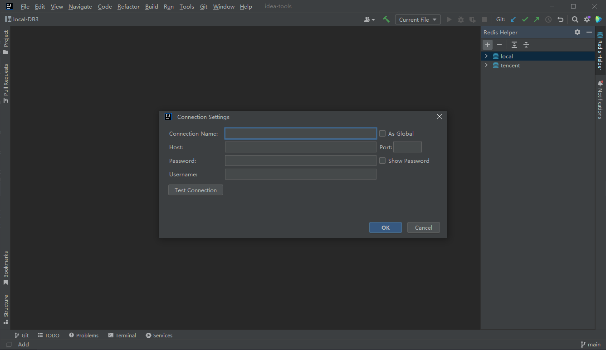
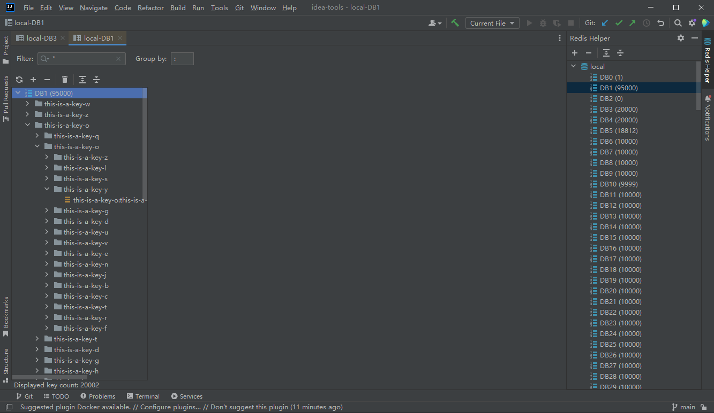
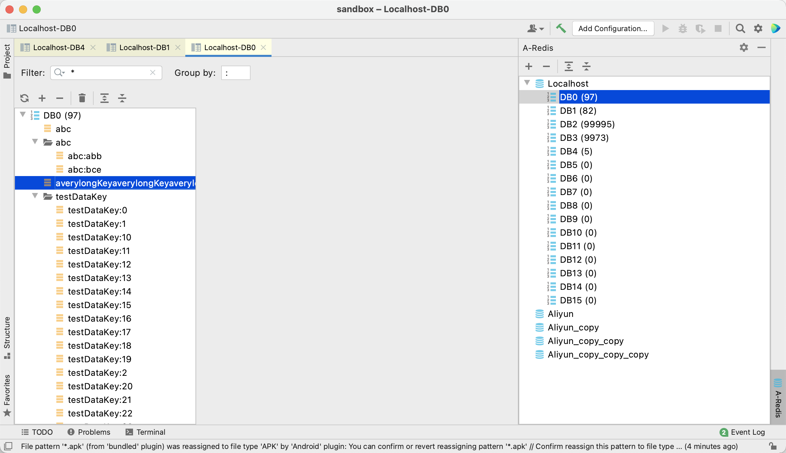
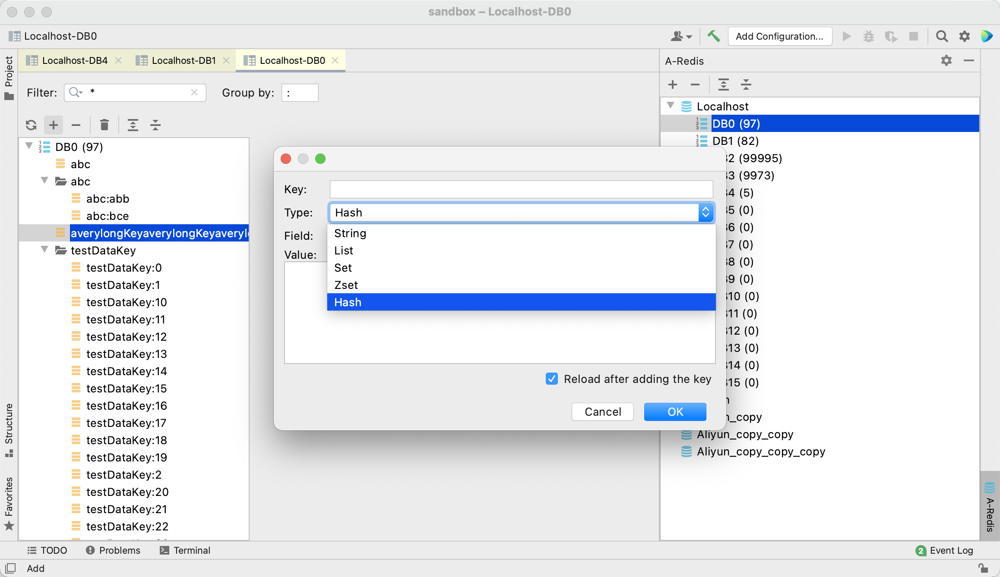
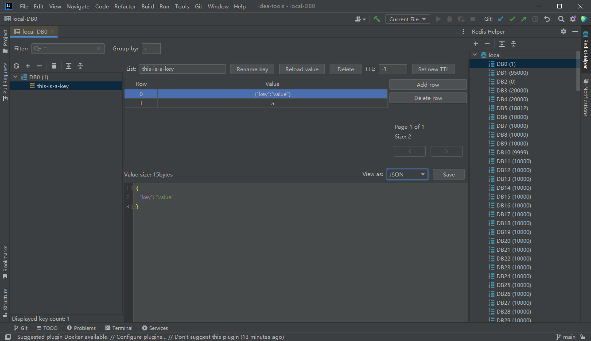
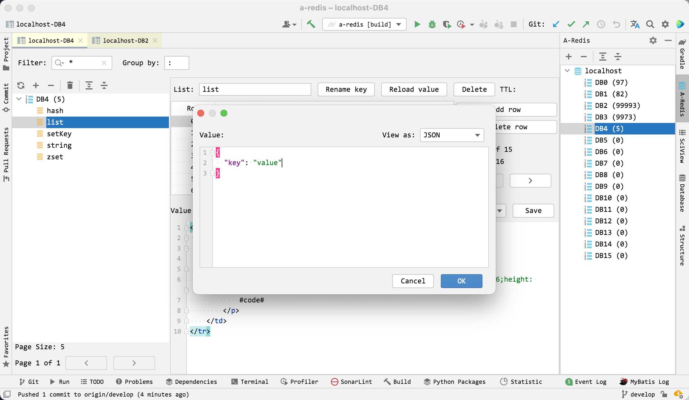

# A-Redis
> A Simple IDEA Redis Plugin
> 
> IDEA Redis 插件

## Function
### 1. Redis connection management
  - add
  - batch delete
  - reload
  - edit
  - duplicate
  - console(not finished)
  - close
  - view the number of keys in DB and DB

### 2. Key management
  - filter(paging)
  - group
  - reload
  - add(String, List, Set, ZSet, Hash)
  - batch delete
  - flush DB
  - quick search
  - rename
  - view type of the key

### 3. Value management
  - reload
  - delete(a row in List/Set/ZSet/Hash)
  - set TTL
  - edit/save(include Value/Field of Hash/Score of ZSet)
  - add(a row in List/Set/ZSet/Hash)
  - paging(List/Set/ZSet/Hash)
  - format value to json(not finished)

## Some Screenshots
Add a connection

DBs

Keys

Keys with group by symbol

Add a key

Value display

Add a row

