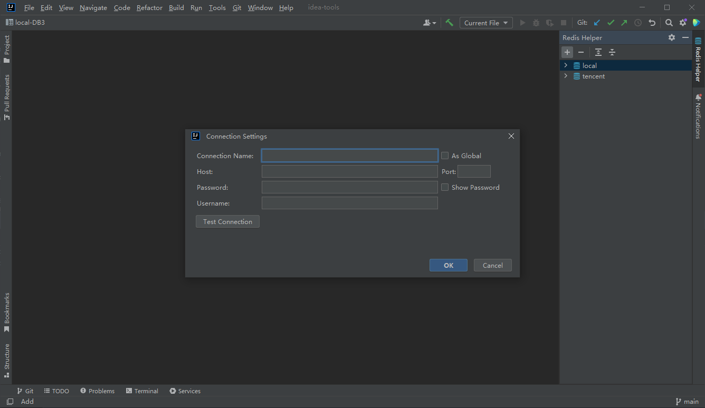
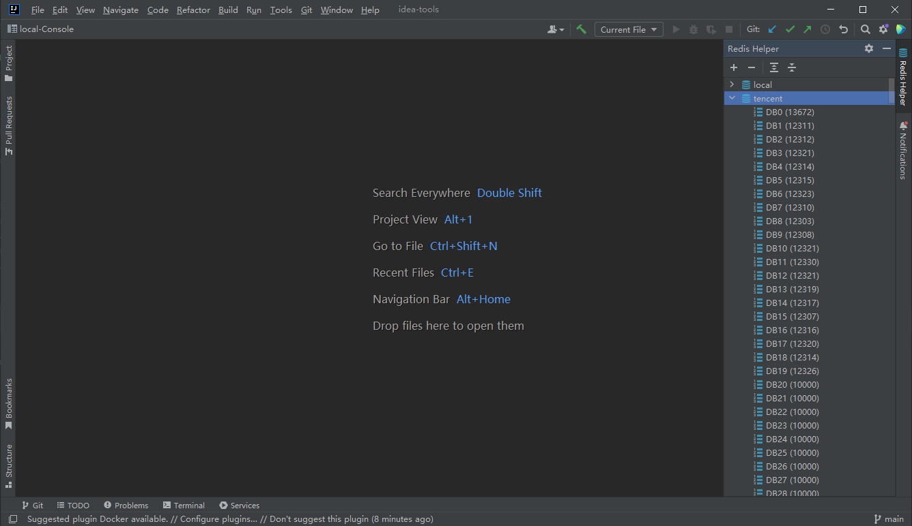
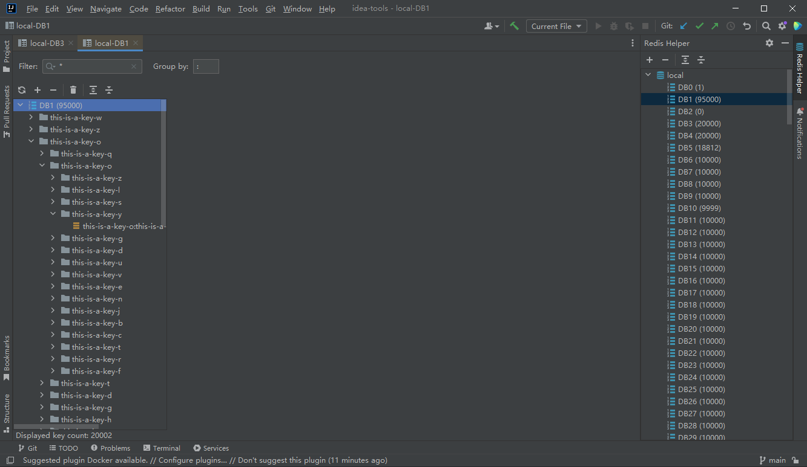
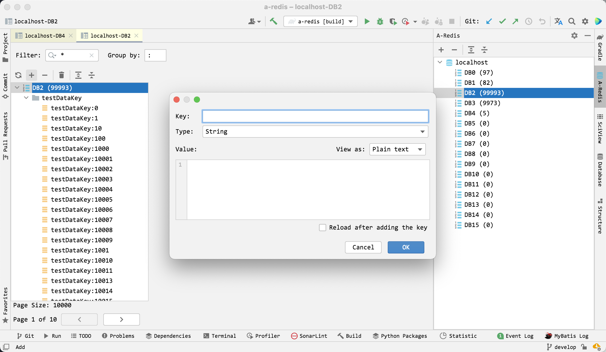
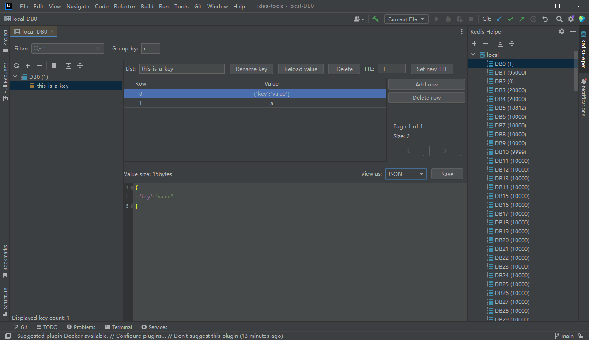
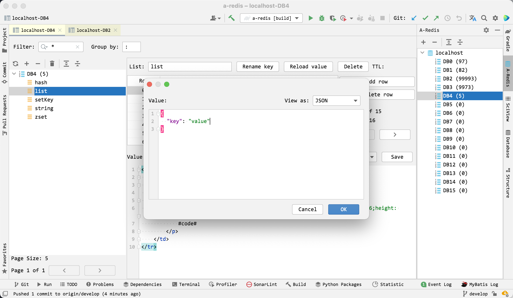
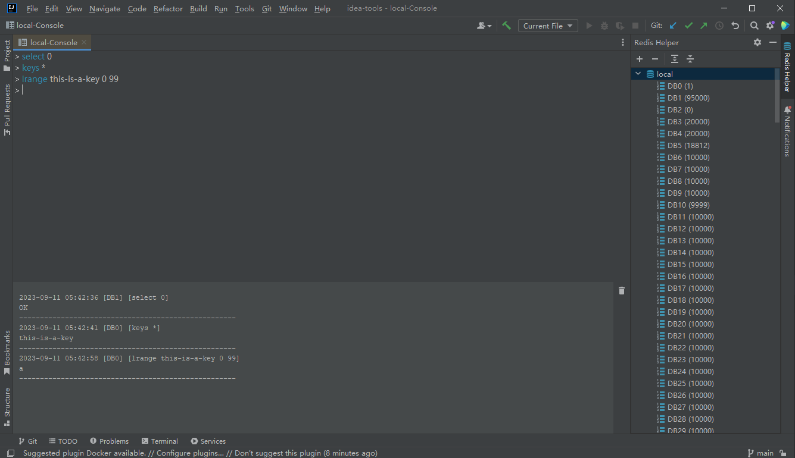
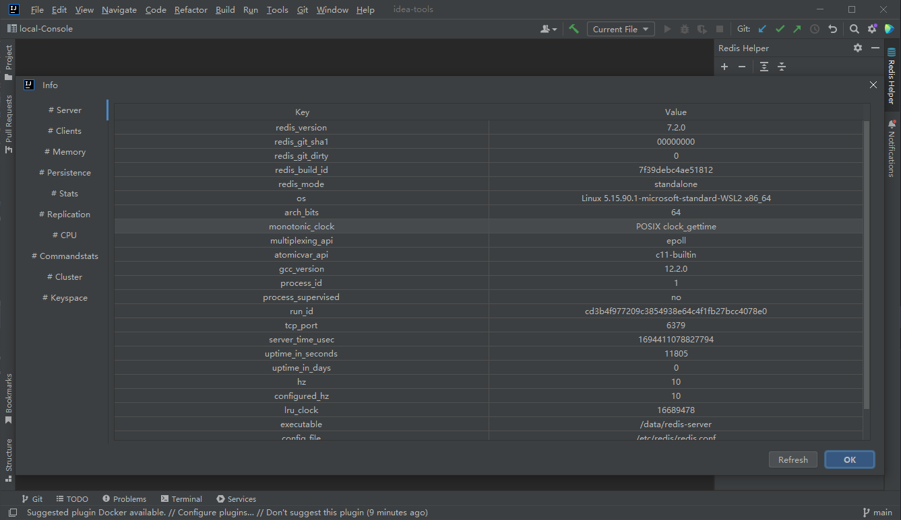

# A-Redis
> An open source IntelliJ-based Redis client for managing connections, browsing keys, editing values, and running Redis commands directly inside your IDE.
> 
> 基于 IntelliJ 的 Redis 插件 / IDEA Redis 插件
> 
> [IntelliJ IDEs Plugin Marketplace](https://plugins.jetbrains.com/plugin/17595-redis-helper)

## Features
### 1. Connection Management
  - Create, edit, duplicate, reload, close, and batch delete Redis connections
  - Connect to standalone Redis servers or Redis Cluster seed nodes
  - Support SSL/TLS connections with trust-all, CA/truststore, and client keystore options
  - Support SSH tunnels with password or private-key authentication
  - View Redis DBs and key counts
  - Open Redis INFO details asynchronously without blocking the IDE

### 2. Key Management
  - Browse keys by database
  - Filter, group, reload, rename, and batch delete keys
  - Add String, List, Set, ZSet, and Hash keys
  - Flush the current DB with confirmation
  - Quickly inspect key type and key structure

### 3. Value Management
  - View and edit String, List, Set, ZSet, and Hash values
  - Add or delete rows in List, Set, ZSet, and Hash values
  - Edit Hash fields and ZSet scores
  - Set TTL and save value changes
  - Page through large List, Set, ZSet, and Hash values
  - Format values as JSON, XML, or HTML for easier reading

### 4. Redis Console
  - Run Redis commands from an editor-like console
  - Use command history, re-run, copy, and collapsible output actions
  - Search all console output or search within a selected result block
  - Improved command parsing for quoted arguments
  - Cluster mode supports common routed commands; unsupported commands show a clear message

## Some Screenshots
Add a connection

DBs

Keys

Add a key

Value display

Add a row

Console

Info

