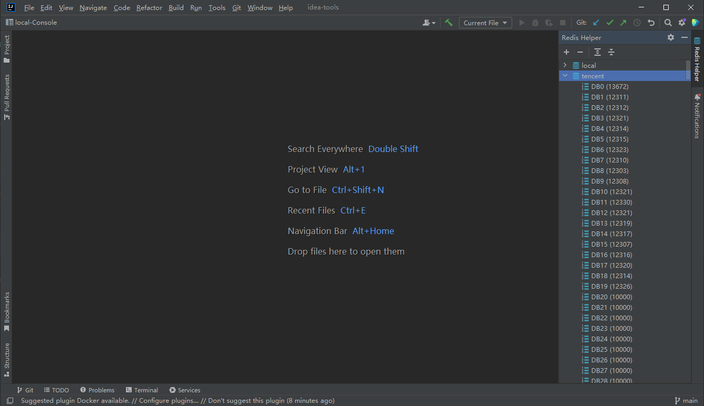
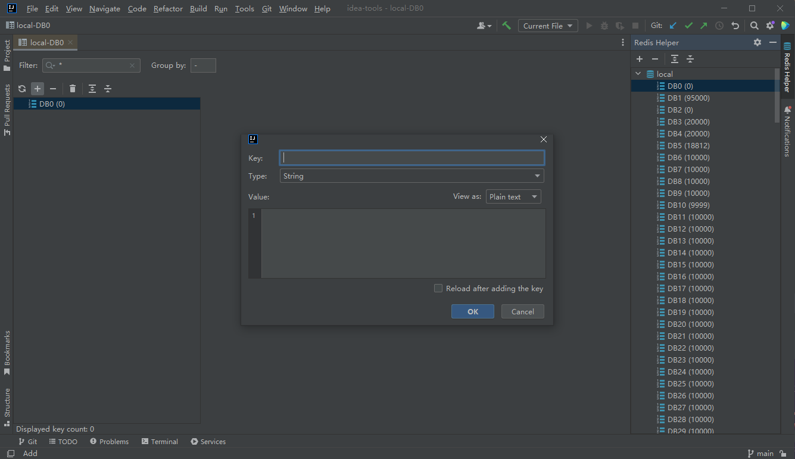
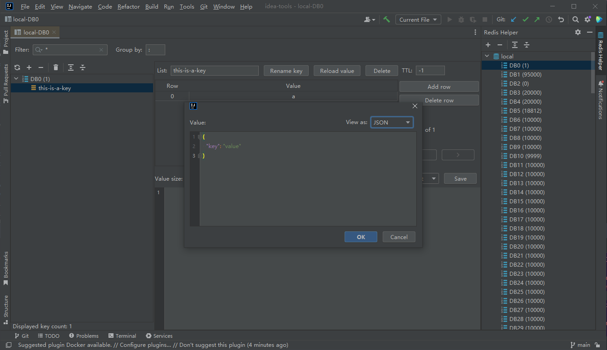

# A-Redis
> A Simple IntelliJ-based Redis Plugin
> 
> 基于IntelliJ的Redis插件 / IDEA Redis插件
> 
> [IntelliJ IDEs Plugin Marketplace](https://plugins.jetbrains.com/plugin/17595-redis-helper)

## Warning/警告

- Due to the change in password persistence in beta-0.9.0, the password will be erased after upgrading, so you need to backup your password before upgrading from beta-0.8.0 and earlier to beta-0.9.0 and later.
- 由于 beta-0.9.0 版本修改了密码的持久化方式, 升级后密码会被清除, 所以从 beta-0.8.0 及其之前的版本升级到 beta-0.9.0 及其之后版本之前需要备份密码

## Function
### 1. Redis connection management
  - add
  - batch delete
  - reload
  - edit
  - duplicate
  - console (The 'RESTORE' command and blocking commands such as 'SUBSCRIBE' are not supported)
  - info (Various information and statistical values about the Redis server)
  - close
  - view the number of keys in DB and DB

### 2. Key management
  - filter(paging)
  - group
  - reload
  - add(String, List, Set, ZSet, Hash)
  - batch delete
  - flush DB
  - quick search
  - rename
  - view type of the key

### 3. Value management
  - reload
  - delete(a row in List/Set/ZSet/Hash)
  - set TTL
  - edit/save(include Value/Field of Hash/Score of ZSet)
  - add(a row in List/Set/ZSet/Hash)
  - paging(List/Set/ZSet/Hash)
  - format value to json

## Some Screenshots
Add a connection

DBs

Keys

Add a key

Value display

Add a row

Console

Info

